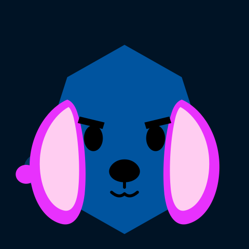
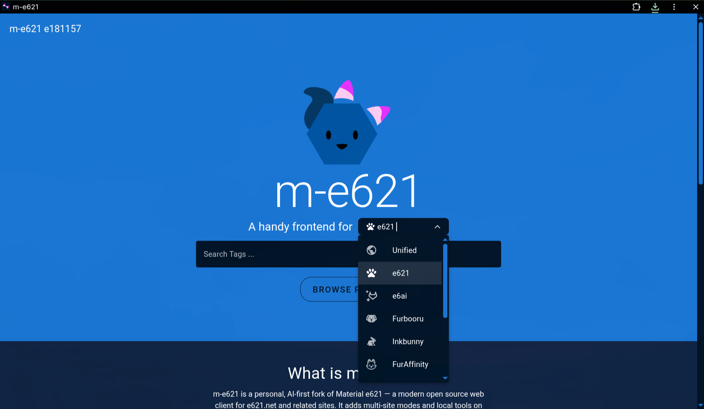
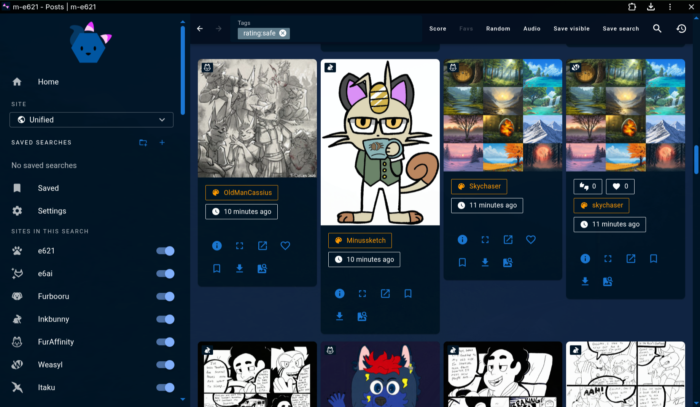
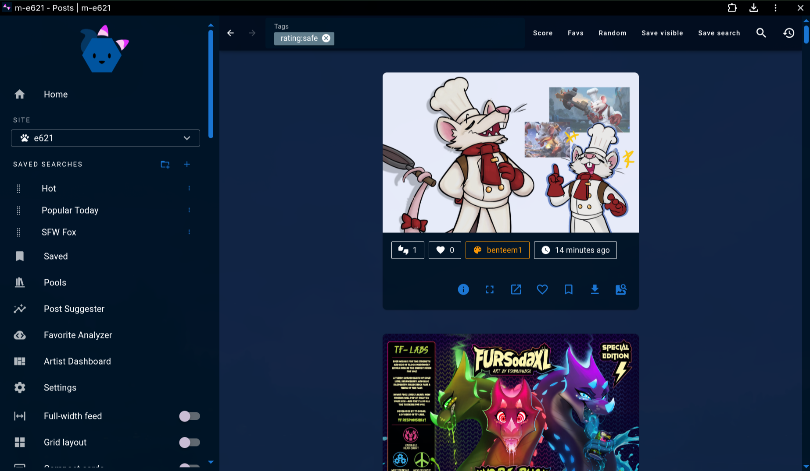
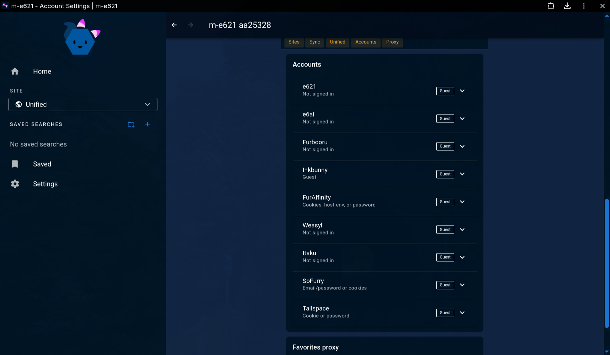
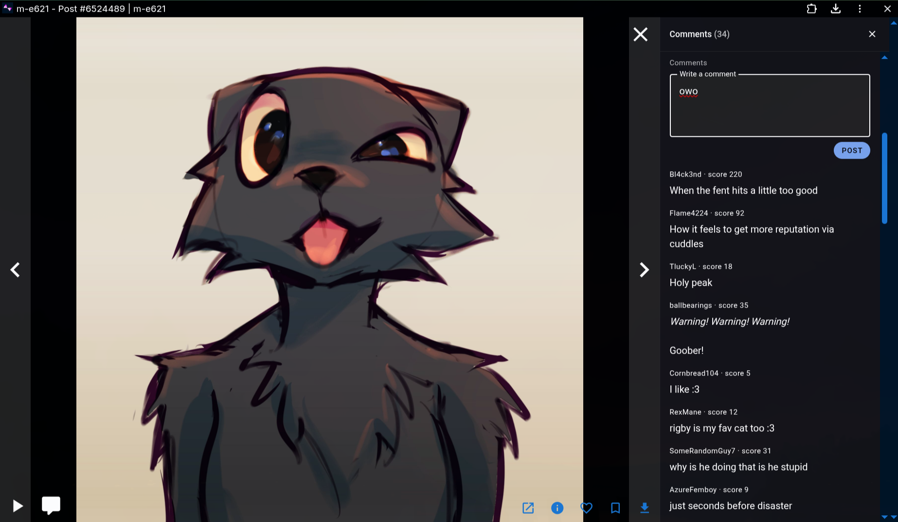
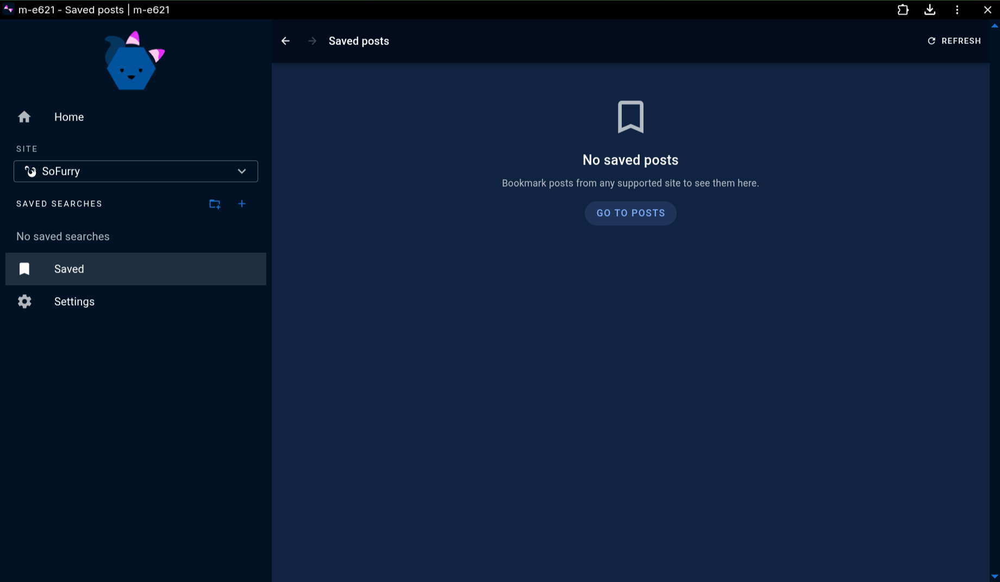
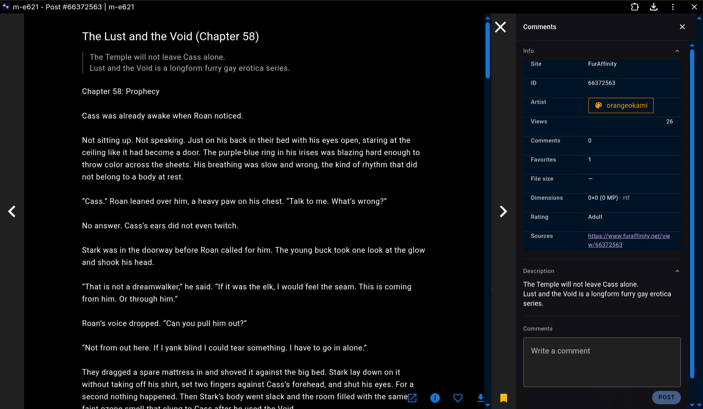
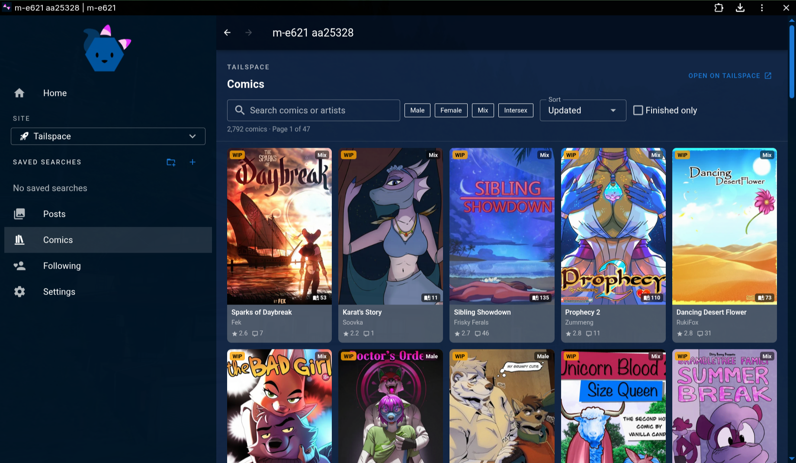
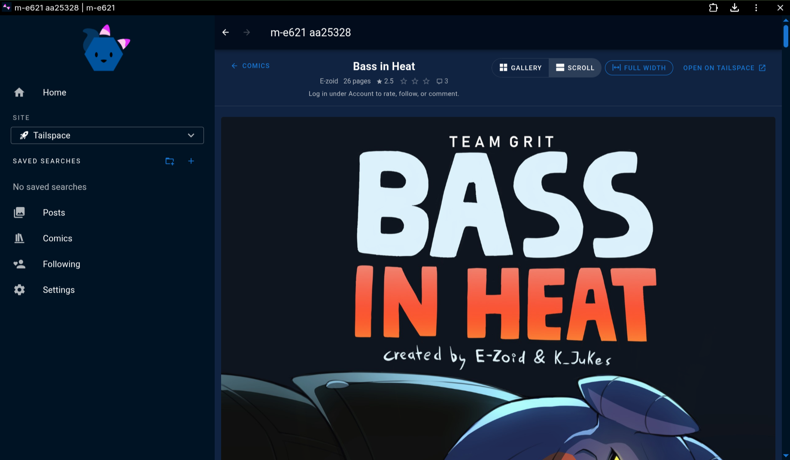

<div align="center">
  
  <h1>m-e621</h1>
  <p>A multi-site imageboard browser and local media library.</p>
  <p>
    <a href="https://m-e621.tonypup.box.ca">Live</a>
    ·
    <a href="./README-CONTINUED.md">Documentation</a>
    ·
    <a href="https://github.com/lovelyspacedog/m-e621">Repository</a>
    ·
    <a href="https://material-e621.avoonix.com">Upstream</a>
  </p>
</div>

---

m-e621 expands [Material e621](https://github.com/avoonix/material-e621) with additional sites, a Unified feed, local media management, and richer browsing tools. It is built with Vue 3 and Vuetify.

A public instance is operable at **[m-e621.tonypup.box.ca](https://m-e621.tonypup.box.ca)**.

> [!NOTE]
> This is an experimental, AI-assisted personal project. For a stable e621-only client, use upstream Material e621.

## Highlights

- **Nine supported sites** — browse e621, e6ai, Furbooru, Inkbunny, FurAffinity, Weasyl, Itaku, SoFurry, and Tailspace from one interface.
- **Unified browsing** — date-merge child sites into a Search or Following feed, with Defaults / Auth-only presets, per-site filters, and origin-aware actions.
- **Local library** — browse a folder on disk with fuzzy search, favorites, remux, and portable sidecars (Chromium or the Tauri desktop build).
- **Independent accounts** — configure authentication, blacklists, favorites, history, and preferences for each site.
- **Saved posts** — bookmark posts across federated sites in one mode-independent list.
- **Community features** — view and post comments, vote, favorite, follow creators, and open posts at their source where supported. Anonymous **Scent Marks** guestbook on the landing page for short public notes.
- **Flexible feeds** — switch between full-width lists, thumbnail grids, and compact cards with rich filtering and media controls.
- **Powerful browsing tools** — browse and watch pools (e621-family, with new-page badges), organize starred tags and saved searches, use the multi-site post suggester and favorite analyzer, and explore artist dashboards (heatmap, top posts, tag ranks).
- **Comics and stories** — dedicated pool and Tailspace comic readers (pool fullscreen continues across chunks; `?post=` resume; Save chunk/all) plus fullscreen story, PDF, RTF, and DOCX previews.
- **Immersive media** — fullscreen comments rail, notes, slideshows, auto-next, Fluffle reverse-image search, and remembered audio/video playback settings (including optional per-site overrides).
- **Safer settings** — searchable hub (with synonyms), confirm/preview restore, sanitized backups, partial section reset, System/Dark/Light color scheme, auth probe chips, and clear which site profile blacklist/history edits.

## Preview

> Content shown in screenshots may be NSFW.

[](./screenshots/landing-page.png)

[](./screenshots/grid-and-unified-mode.png)

<details>
  <summary>More screenshots</summary>

[](./screenshots/e621-site-home.png)

[](./screenshots/accounts-login.png)

[](./screenshots/comments-bar.png)

[](./screenshots/universal-saved-posts-bookmarks.png)

[](./screenshots/story-mode.png)

[](./screenshots/tailspace-comics-page.png)

[](./screenshots/tailspace-comic-scroll.png)

</details>

## Get started

Requires **Node.js 20+** and **npm**.

```bash
npm install
npm run dev
```

### Self-host

Build and run the included Python proxy:

```bash
npm run build
M_E621_ROOT="$PWD/dist" M_E621_DIR="$PWD" python3 serve.py
```

Or use Docker:

```bash
docker compose up --build
```

For authentication, site support, Local mode, remuxing, Docker, Tauri, deployment, and limitations, read the **[complete guide](./README-CONTINUED.md)**.

## Project status

Active personal fork. Features may be incomplete or change without notice. This project is not affiliated with its supported sites or upstream maintainers. Follow each site's rules, age requirements, and API terms.

## License

[AGPL-3.0](./LICENSE). Network use of a modified version requires offering the corresponding source.
