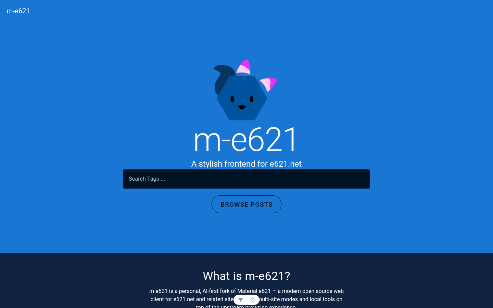
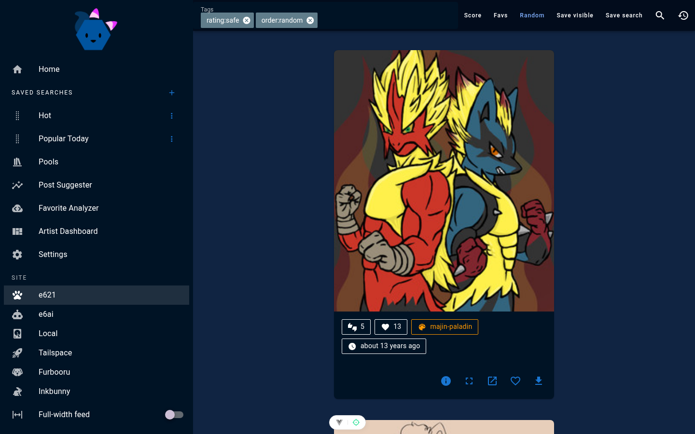
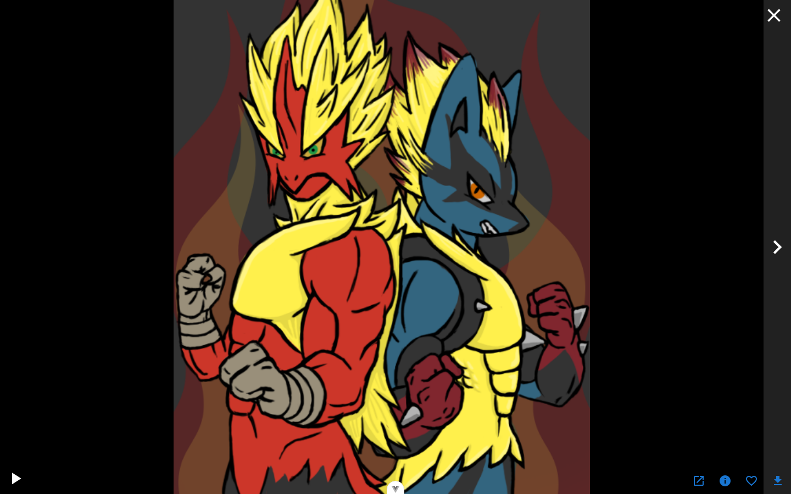
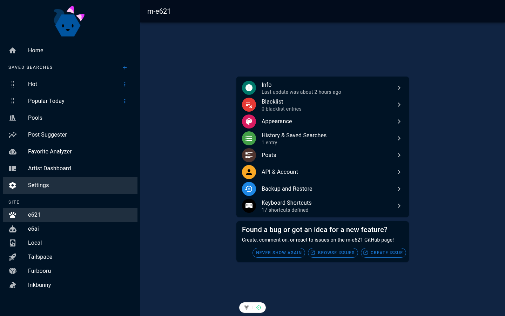
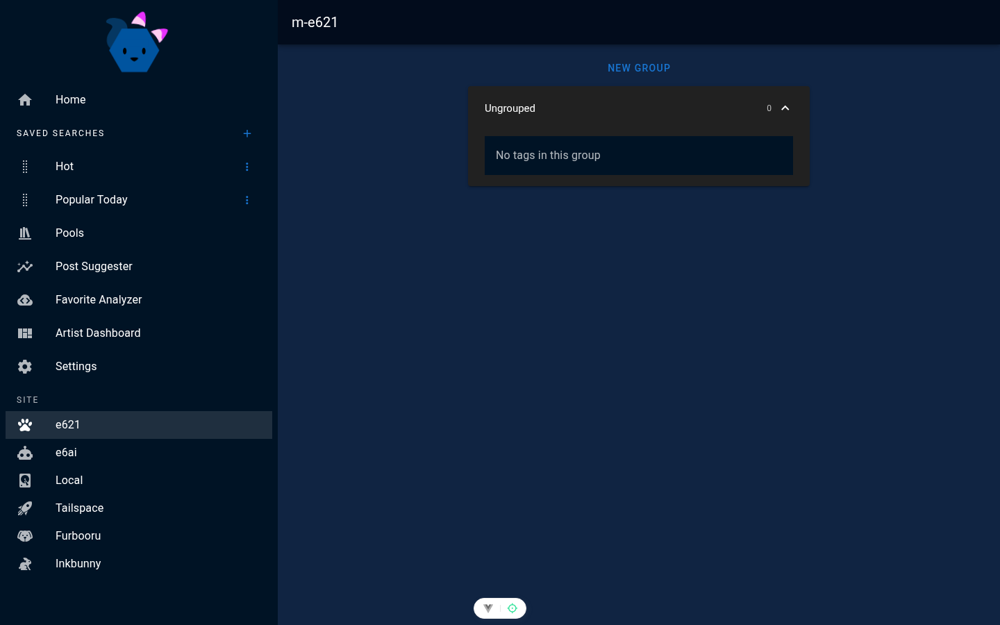
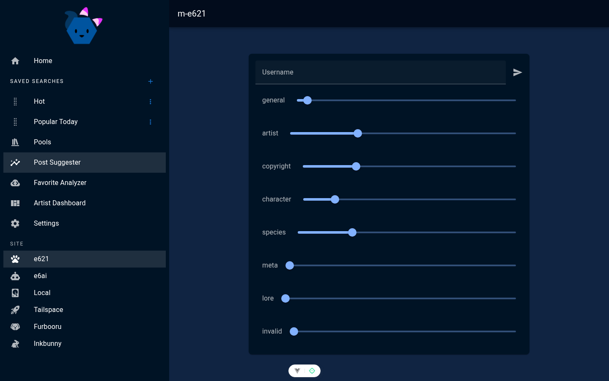
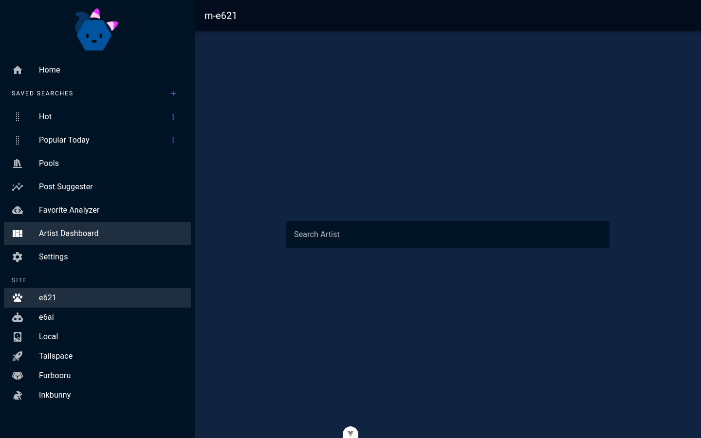
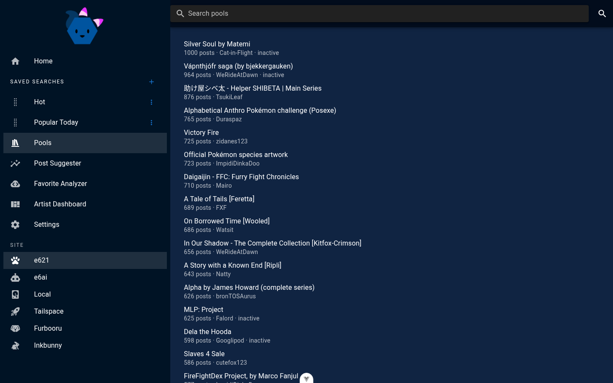
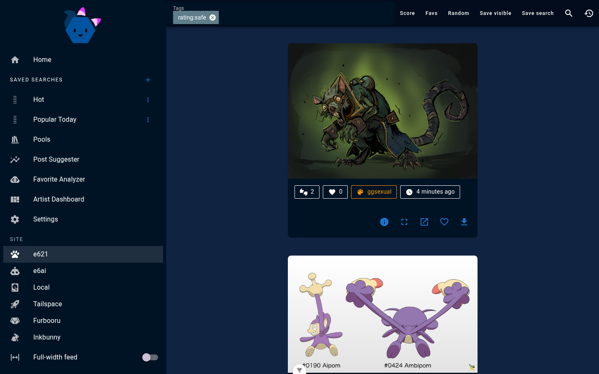

# m-e621

**m-e621** is a personal fork of [Material e621](https://github.com/avoonix/material-e621) — a Vue 3 / Vuetify web client for browsing imageboard posts.

This is **not** a polished product with a roadmap and support team. It is a **personal, AI-first side project**: most features and fixes are built with heavy AI assistance (Cursor / coding agents), reviewed and steered by a human. Expect uneven edges, experimental site modes, and changes that prioritize “works for me” over general polish.

Upstream remains the better choice if you want a stable, e621-focused client:

- This fork: [github.com/lovelyspacedog/m-e621](https://github.com/lovelyspacedog/m-e621)
- Upstream app: [material-e621.avoonix.com](https://material-e621.avoonix.com)
- Upstream repo: [avoonix/material-e621](https://github.com/avoonix/material-e621)

---

## What this fork adds

Compared to upstream Material e621, m-e621 expands the client into a **multi-site browser** with local media tools and self-host plumbing.

### Multi-site modes

Switch sites from the sidebar. Each mode keeps its **own profile** (auth, blacklist, saved searches, history, favorites where applicable):

| Mode | What you get |
|------|----------------|
| **e621** | Classic Material e621 experience (pools, suggester, analyzer, dashboard, …) |
| **e6ai** | e6ai browsing with mode-aware labels (e.g. directors instead of artists) |
| **Furbooru** | Site mode with API-key auth, tags, comments, faves/votes |
| **Inkbunny** | Hybrid site mode; Flash/SWF playback via [Ruffle](https://ruffle.rs/) |
| **Tailspace** | Posts + in-app comic reader (page chunks, scroll reading, comments) |
| **Local** | Browse a folder on disk (File System Access API); fuzzy search, random order, posters, resume, favorites |

### Feed & browsing UX

- Full-width feed layout
- Starred-tag folders in the sidebar
- Fullscreen slideshow + card auto-next
- Inline video playback on post cards
- Score / Favs quick actions on the search bar
- Manage saved searches from the sidebar
- Collapsed long artist tag lists on cards

### Local save & remux

- **Save Locally** — download posts to a chosen folder (or Downloads fallback), with smarter filenames (species + tags)
- Same-origin ffmpeg worker for Local remux / playback helpers
- Local browse folder is separate from the Save Locally folder

### Self-host & proxy layer

Upstream’s static Docker image is still fine for e621-only hosting. This fork also ships a Python `serve.py` that:

- Serves the built `dist/`
- Proxies favorites / votes / comments / downloads (avoids origin-locked Vercel workarounds)
- Proxies Tailspace, Furbooru, and Inkbunny APIs for the multi-site modes
- Optional git-pull control for a managed self-hosted instance

### Other

- Zen Browser / Transparent Zen CSS compatibility (`public/zen-browser.css`)
- PWA update banner improvements (periodic poll + clearer update text)
- Dual commit timelines on the landing page (fork vs upstream)

---

## Screenshots

Fresh captures from this fork (site switcher, m-e621 branding). Content in posts may be NSFW — treat accordingly.

[](./screenshots/m-e621-landing.png)

[](./screenshots/m-e621-posts.png)

[](./screenshots/m-e621-fullscreen.png)

[](./screenshots/m-e621-settings.png)

[](./screenshots/m-e621-starred.png)

[](./screenshots/m-e621-suggester.png)

[](./screenshots/m-e621-dashboard.png)

[](./screenshots/m-e621-pools.png)

[](./screenshots/m-e621-site-modes.png)

---

## Before you use this

- **AI-first development.** Large chunks of code, refactors, and bugfix passes were written by AI agents. The human owner directs intent, tests what they use, and merges — this is not “hand-crafted artisan frontend.”
- **Personal scope.** Features exist because the maintainer wanted them (Tailspace comics, Local folder, Inkbunny SWF, etc.). Unsupported site quirks may stay broken until they matter to that workflow.
- **Not affiliated** with e621, e6ai, Furbooru, Inkbunny, Tailspace, or the upstream Material e621 maintainers beyond being an AGPL fork.
- **Content warning.** This client talks to adult imageboards. You are responsible for following each site’s rules, age requirements, and API terms.

---

## Usage

### Development

Requires **Node.js ≥ 20** and **npm** (yarn/pnpm are blocked in `package.json`).

```bash
npm install
npm run dev
```

Useful scripts:

```bash
npm run build          # type-check + production build
npm run type-check
npm run lint
npm run test:unit
npm run test:e2e       # Playwright
```

### Self-host with `serve.py` (multi-site)

Build, then serve `dist/` with the included proxy server:

```bash
npm install
npm run build
export M_E621_ROOT="$(pwd)/dist"
export M_E621_DIR="$(pwd)"
export M_E621_HOST="127.0.0.1"
export M_E621_PORT="18621"
python3 serve.py
```

Open `http://127.0.0.1:18621`. Environment variables are documented at the top of `serve.py`.

Optional helpers (`start`, `sync`, `deploy.sh`, `serve.py`) support a reverse-proxied self-host. Personal hostnames and secrets belong in **`~/.config/m-e621/env`** or a gitignored **`deploy.env`** — see [`deploy.env.example`](./deploy.env.example). Committed scripts default to `localhost` / public HTTPS clone URLs only.

### Docker (upstream-style static host)

```bash
sudo docker run -d -p 8080:80 ghcr.io/avoonix/material-e621:latest
```

Or `docker compose up` with the included [`docker-compose.yml`](./docker-compose.yml).

> **Note:** The published GHCR image is upstream’s. It will not include this fork’s multi-site proxy layer. For Furbooru / Inkbunny / Tailspace / Local remux helpers, use a local `npm run build` + `serve.py` (or build your own image from this tree).

### Desktop (Tauri)

Same as upstream: install Rust + Node, then:

```bash
pnpm install   # only if you follow Tauri docs; this app’s web scripts use npm
cargo install tauri-cli
cargo tauri build
```

(Prefer `npm` for the web app itself; Tauri tooling may differ.)

---

## Stack

- Vue 3, Vue Router, Pinia, Vuetify 3
- Vite + PWA
- Comlink workers for API / analyze / dashboard work
- `@ffmpeg/ffmpeg` for Local remux helpers
- `@ruffle-rs/ruffle` for Flash/SWF
- Python 3 stdlib HTTP server (`serve.py`) for self-host proxies

---

## Project status

Active personal fork. Breaking changes and incomplete site modes can land without ceremony. Contributions are welcome if you are comfortable with AI-authored diffs, incomplete docs, and “fix what you care about” review.

If you only need e621 with Material Design polish, use [upstream](https://github.com/avoonix/material-e621).

---

## License

GNU Affero General Public License v3.0 — see [`LICENSE`](./LICENSE).

This project inherits AGPL-3.0 from Material e621. Network use of a modified version requires offering corresponding source.
